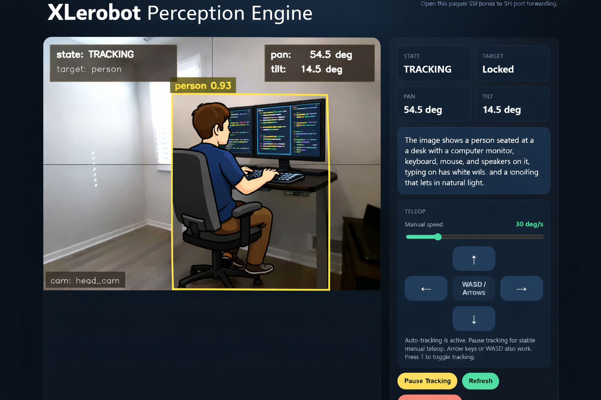

# XLeRobot Perception Enigine

| Tracking | Sweeping |
| --- | --- |
|  |  |

A runnable starter project for:

1. Real-time pan/tilt camera head tracking (moving objects in FOV)
2. Scene description and simple conversational interaction
3. LeRobot-compatible robot wrapper for easy migration to real hardware

## What is implemented

- `xlerobot_personality.xlerobot_head.XLERobotHead`
  - LeRobot-style `Robot` API (`connect`, `get_observation`, `send_action`, `disconnect`)
  - Pan/tilt action keys: `pan.pos`, `tilt.pos`
  - Camera observation key: `head_cam`
  - Works in `mock` mode (no hardware) and in `feetech+camera` mode (starter wiring)
- `xlerobot_personality.tracking_controller`
  - Detector-backed target tracking from camera frames
  - PID-based pan/tilt control with safety clamps and step limiting
  - Personality FSM: `IDLE_SCAN`, `TRACKING`, `REACQUIRE`, `INTERACTING`
- `xlerobot_personality.scene_agent`
  - Keeps short scene memory
  - Produces periodic scene summaries
  - Can describe camera frames at 1 Hz with a local Ollama vision model such as `qwen2.5vl:3b`
  - Can run an Ollama chat "brain" that fuses VLM scene summary + tracker context + user query
  - Replies in a cute, concise, witty style when the Ollama brain is enabled
  - Optional OpenAI VLM hook if `openai` dependency and key are configured
- `xlerobot_personality.orchestrator`
  - Async loops for tracking, scene summarization, and dialog

## Quick start (mock mode, runnable now)

```bash
cd /path/to/this-repo
python -m venv .venv
source .venv/bin/activate
pip install -e .
python -m xlerobot_personality.main --dry-run --visualize
```

Type questions in terminal while it runs (for example: `what do you see?`).
Type `quit` to stop.

## Ollama vision scene descriptions

The scene loop can now generate a short camera description every second with a local Ollama vision model.

Start Ollama and pull a vision checkpoint (plus an optional lightweight chat model for robot dialogue):

```bash
ollama pull qwen2.5vl:3b
ollama pull qwen2.5:1.5b
ollama serve
```

Enable it in config:

```yaml
scene:
  summary_hz: 1.0
  use_ollama: true
  vlm_model: qwen2.5vl:3b
  use_brain: true
  brain_model: qwen2.5:1.5b
  ollama_url: http://127.0.0.1:11434
```

With that enabled, the `[scene]` log line and browser summary panel will show a fresh short paragraph roughly once per second without blocking the tracking loop.

When `use_brain: true`, terminal chat (`ask>`) is routed through the lightweight Ollama chat model and grounded with:

- cached scene description context from the scene loop (VLM/rule-based; no extra VLM call per user query)
- current person/target tracking status from the detector/tracker
- recent chat history (configurable, default 10 turns)
- user query

If `runtime.speech.enabled: true`, each terminal answer is also spoken with a local Piper voice model and played through a local audio command such as `aplay`.

## Piper speech output

Install the optional Piper dependency and download a voice:

```bash
cd /path/to/this-repo
source .venv/bin/activate
pip install -e ".[piper]"
python3 -m piper.download_voices en_US-lessac-medium
```

Then point config at the downloaded `.onnx` file:

```yaml
runtime:
  speech:
    enabled: true
    backend: piper
    model_path: /path/to/en_US-lessac-medium.onnx
    config_path: null
    audio_player: auto
```

If `config_path` is omitted, the app defaults to `<model_path>.json`.
If the first syllable gets clipped on your audio device, increase `runtime.speech.lead_in_ms` to add a little silence before each spoken reply.
On Ubuntu/PipeWire/PulseAudio setups, `paplay` is usually a better first choice than `aplay` for avoiding clipped sentence starts.

## Web preview over SSH

For headless servers or Windows SSH sessions, use the browser preview instead of X11:

```bash
# on the server
cd /path/to/this-repo
source .venv/bin/activate
PYTHONPATH=src python -m xlerobot_personality.main \
  --config configs/local_demo.yaml \
  --dry-run \
  --web-preview \
  --no-visualize
```

Forward the port from your local machine:

```bash
ssh -L 8765:127.0.0.1:8765 your_user@your_server
```

Then open:

```text
http://localhost:8765
```



The page shows the annotated frame, state, pan/tilt values, scene summary, and a stop button.
It also provides:

- Press-and-hold arrow-button teleop for pan/tilt
- Press-and-hold keyboard teleop with `W/A/S/D` or arrow keys
- Adjustable manual-speed slider in the browser
- `Pause Tracking` / `Resume Tracking` toggle in the browser
- Keyboard shortcut `T` to toggle tracking

By default, the app now starts in manual head-control mode. Use `Resume Tracking` in the browser to enable auto-tracking.

## Configuration

Use the provided config:

```bash
python -m xlerobot_personality.main --config configs/local_demo.yaml --dry-run
```

Main fields:

- `hardware.use_mock`: if `true`, servo writes are simulated
- `camera.source`: `synthetic`, `opencv`, or `lerobot`
- `hardware.servo.manual_speed_deg_s`: browser/manual teleop speed
- `hardware.servo.command_smoothing_s`: low-pass smoothing on commanded head position
- `hardware.servo.transition_smoothing_s`: extra smoothing duration used when switching between scan, track, and manual states
- `tracking.backend`: `auto`, `motion`, `hog_person`, `yolo_person`, or `yolo_pose_person`
- `tracking.frame_target_y_ratio`: where in the image you want the tracked target to sit; higher keeps the head aimed lower
- `tracking.tilt_tracking_sign`: auto-tracking tilt direction; for the current browser/manual convention, `-1.0` means "target higher in image -> tilt camera up"
- `tracking.detector_interval`: run the detector every N control frames
- `tracking.detector_confidence`: minimum detector confidence for accepting a person
- `tracking.acquire_confirm_frames`: require this many matching detections before starting a new track
- `tracking.target_selection_mode`: `sticky` to stay on the current person when possible, or `most_centered` to pick whoever is closest to the image center
- `tracking.tilt_error_gain`: scales how aggressively vertical tracking moves the head
- `tracking.person_target_y_ratio`: where inside a person box to aim vertically; higher looks lower on the person
- `tracking.person_min_full_body_aspect_ratio`: if a person box looks too short, infer missing lower body before computing the vertical aim point
- `tracking.person_top_frame_ratio`: desired top-of-person position in the image for headroom control
- `tracking.person_top_framing_gain`: extra vertical correction from the top of the person box; helps the head tilt up when someone stands
- `tracking.person_closeup_height_ratio`: activates stronger headroom control once the person occupies this fraction of image height
- `tracking.person_closeup_top_gain`: extra multiplier for headroom control in close-up framing
- `tracking.yolo_model`: YOLO checkpoint name or path, for example `yolov8n.pt`
- `tracking.yolo_pose_model`: YOLO pose checkpoint name or path, for example `yolov8n-pose.pt`
- `tracking.yolo_device`: inference device, for example `cpu` or `cuda:0`
- `tracking`: PID, loop rate, scan behavior, FOV
- `tracking.start_tracking_enabled`: start in auto-tracking (`true`) or manual mode (`false`)
- `scene.summary_hz`: caption refresh rate; `1.0` means 1 Hz
- `scene.use_ollama`: enable local Ollama vision captions
- `scene.vlm_model`: vision-capable Ollama model, for example `qwen2.5vl:3b`
- `scene.ollama_url`: Ollama server URL, usually `http://127.0.0.1:11434`
- `scene.ollama_timeout_s`: per-request timeout for caption generation
- `scene.ollama_keep_alive`: keeps the local model warm between 1 Hz requests
- `scene.max_image_dim_px`: downsizes frames before sending them to the VLM to keep latency bounded
- `scene.use_brain`: enable the lightweight Ollama chat brain for interactive Q/A
- `scene.brain_model`: Ollama chat model for dialogue, for example `qwen2.5:1.5b`
- `scene.brain_temperature`: sampling temperature for dialogue style/creativity
- `scene.brain_max_tokens`: max generated tokens for each dialogue response
- `scene.include_chat_history`: include recent chat turns in the brain prompt
- `scene.chat_history_max_turns`: number of prior user/robot turns to include (default `10`)
- `scene.vlm_only_on_significant_change`: call VLM only when scene fingerprint changes enough
- `scene.vlm_change_threshold`: normalized frame-difference threshold (0-1)
- `scene.vlm_change_sample_dim_px`: thumbnail size used to measure frame change
- `scene.vlm_target_center_change_ratio`: target-movement threshold before a new VLM call
- `scene.vlm_target_area_change_ratio`: target-scale-change threshold before a new VLM call
- `scene.vlm_force_refresh_s`: force a refresh after this many seconds even if scene is stable
- `scene`: memory window, interaction hold, optional OpenAI settings
- `runtime.web_preview`: enable browser preview
- `runtime.web_host` / `runtime.web_port`: bind address for browser preview
- `runtime.speech.enabled`: speak each terminal answer with Piper
- `runtime.speech.backend`: `piper`
- `runtime.speech.model_path`: path to the Piper `.onnx` voice file
- `runtime.speech.config_path`: optional path to the Piper voice JSON; defaults to `<model_path>.json`
- `runtime.speech.audio_player`: `auto`, `aplay`, `paplay`, `ffplay`, or `afplay`
- `runtime.speech.speaker_id`: optional multi-speaker voice ID
- `runtime.speech.length_scale`: speech speed/length control
- `runtime.speech.noise_scale` / `runtime.speech.noise_w_scale`: optional Piper voice variation controls
- `runtime.speech.volume`: output volume passed to Piper synthesis
- `runtime.speech.use_cuda`: use CUDA for Piper inference if supported
- `runtime.speech.lead_in_ms`: prepend this many milliseconds of silence before playback to avoid clipped sentence starts

## Real hardware integration notes

- For actual pan/tilt servos (Feetech), set:
  - `hardware.use_mock: false`
  - `hardware.serial_port: /dev/ttyUSB...`
  - servo IDs in `hardware.pan_id`, `hardware.tilt_id`
- For LeRobot camera pipeline, set:
  - `camera.source: lerobot`

The `XLERobotHead` class is written to use LeRobot APIs when available and otherwise remain runnable in mock mode.

### Running on real hardware

Current support assumes:

- pan/tilt servos are Feetech servos supported by LeRobot
- camera is available through OpenCV (`camera.source: opencv`)
- you will either point to an existing head calibration JSON or generate one with the utility below
- real camera auto-tracking uses `yolo_person` when `ultralytics` is installed, otherwise it falls back to `hog_person`

For the YOLO backend, install the optional dependency in the same virtualenv:

```bash
cd /path/to/this-repo
source .venv/bin/activate
pip install -e ".[yolo]"
```

Then set either:

- `tracking.backend: auto` to prefer YOLO when available
- or `tracking.backend: yolo_person` to require YOLO explicitly

The default sample config uses:

- `tracking.backend: auto`
- `tracking.yolo_model: yolov8n.pt`

If `yolov8n.pt` is not already on disk, Ultralytics will try to download it on first run.

Install the required motor support in the same virtualenv:

```bash
cd /path/to/this-repo
source .venv/bin/activate
pip install "lerobot[feetech]"
```

Find your hardware:

```bash
lerobot-find-port
lerobot-find-cameras opencv
```

Then edit [real_head.example.yaml](configs/real_head.example.yaml):

- set `hardware.serial_port`
- set the real `pan_id` and `tilt_id`
- set `camera.device_index`
- set `hardware.robot_id`
- set `hardware.calibration_dir` to the folder containing `<robot_id>.json`
- config path fields may use `~`, `${HOME}`, or relative paths resolved from the config file location

Important:

- this app reads and writes motor positions in normalized units, so the calibration file must exist before running

Generate the first calibration file with the interactive head utility:

```bash
cd /path/to/this-repo
source .venv/bin/activate
PYTHONPATH=src python -m xlerobot_personality.head_calibrate \
  --config configs/real_head.example.yaml
```

The utility will:

- connect to the Feetech bus on `hardware.serial_port`
- ask you to place the head in a neutral forward pose
- record the raw encoder center offsets
- ask you to sweep pan and tilt through their full safe ranges
- save `<hardware.robot_id>.json` in `hardware.calibration_dir`

If you want to override the config file values, pass explicit CLI flags such as `--serial-port`, `--pan-id`, and
`--tilt-id`.

There is also a helper launcher:

```bash
./mybash/calibrate_head.sh
```

Launch on real hardware:

```bash
cd /path/to/this-repo
source .venv/bin/activate
PYTHONPATH=src python -m xlerobot_personality.main \
  --config configs/real_head.example.yaml \
  --web-preview \
  --no-visualize
```

The sample real-head config enables `scene.use_ollama: true` with `qwen2.5vl:3b`, so once `ollama serve` is up you should see a short scene paragraph at 1 Hz in both the terminal and browser preview.

Or use the helper script:

```bash
./mybash/run_real_browser.sh
```
